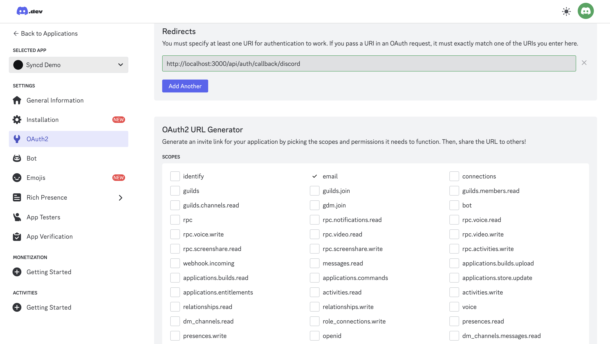
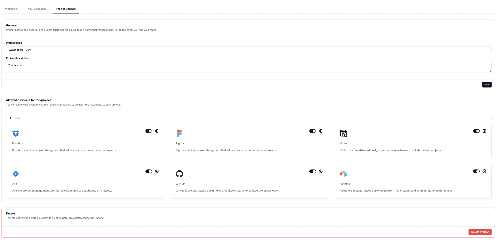
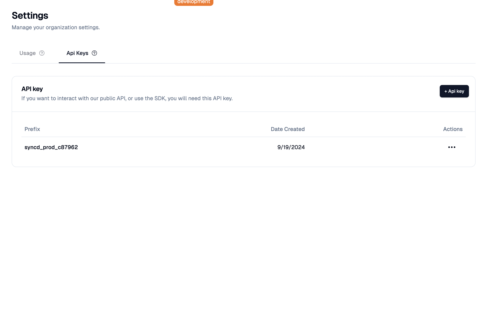

# Syncd SDK Integration

This project uses the Syncd SDK to enhance your application's functionality. Follow the steps below to set up and use the Syncd SDK in your project.

## Installation

You can start this project by running the following command:

### Using pnpm

```bash
pnpm install
```

### Using npm

```bash
npm install
```

### Using yarn

```bash
yarn install
```

### Then run this command to push the schema to the local SQLite database:

```bash
pnpm db:push
```

or

```bash
yarn db:push
```

or

```bash
npm run db:push
```

## Environment Setup

1. Copy the `.env.example` file to create a new `.env` file:

```bash
cp .env.example .env
```

2. Update the `.env` file with your specific values:

   - Generate a `NEXTAUTH_SECRET` using:
     ```bash
     openssl rand -base64 32
     ```
   - Set up Discord OAuth:
     - Go to the [Discord Developer Portal](https://discord.com/developers/applications/)
     - Create a new application
     - In the "OAuth2" section, add a redirect URL: `http://localhost:3000/api/auth/callback/discord`
     - Copy the Client ID and Client Secret
     - Update `DISCORD_CLIENT_ID` and `DISCORD_CLIENT_SECRET` in your `.env` file
   - Set up Syncd:
     - Get your Syncd API key (see the "Getting Your Syncd API Key" section below)
     - Update `SYNCD_API_KEY` and `SYNCD_WEBHOOK_CALLBACK_URL` in your `.env` file
     - The API url should already be in the `.env.example` file as `SYNCD_API_URL`

3. A helper image (`discord-helper.png`) is included in the `public` directory to assist with Discord authentication implementation:

   

4. Syncd DEV Site and Login:
   - The main DEV site URL is [https://syncd-www-dev.vercel.app/](https://syncd-www-dev.vercel.app/)
   - Use the email we discussed for login to access the Syncd dashboard and features

## Setting Up Your Providers in the Dashboard

Before using the Syncd SDK, you need to set up your providers in the Syncd dashboard. Follow these steps:

1. Log in to your Syncd dashboard.
2. Navigate to the "Providers" section.
3. For each provider you want to use (e.g., Discord, GitHub), toggle the switch to enable it.
4. Enter the required `client_id` and `client_secret` for each enabled provider.

Here's an example of what the provider setup looks like in the Syncd dashboard:



Make sure to save your changes after configuring each provider.

## Usage

To use the Syncd SDK in your project, follow these steps:

1. Import the SDK in your project:

```javascript
import { SyncdSdk } from "syncd-sdk";
```

2. Initialize the SDK with your project ID:

```javascript
import { SyncdSdk } from "syncd-sdk";

export const syncdNodeClient = new SyncdSdk({
  apiKey: env.SYNCD_API_KEY,

  // Note: This is not a required field
  // Defaults to use the PROD Syncd API
  // DO NOT REMOVE FOR THE DEMO
  apiUrl: env.SYNCD_API_URL,
});
```

## Important Note on SDK Usage

This application demonstrates the integration of the Syncd SDK, which is primarily designed as a Node.js SDK. However, for the purposes of this example repository, we leverage the SDK's API feature. This approach allows developers to:

1. Interact directly with the Syncd API
2. Explore and understand the available API endpoints
3. Examine the required parameters and pathnames for each API call
4. Test API responses in a controlled environment

By utilizing the SDK's API feature, this example provides a comprehensive overview of the Syncd API's capabilities without the need for a full Node.js backend implementation. This setup is ideal for developers who want to:

- Quickly prototype Syncd integrations
- Understand the API structure before full implementation
- Test API responses in a frontend-focused environment

Remember that in a production Node.js application, you would typically use the full range of SDK features for optimal performance and integration.

## Getting Your Syncd API Key

To obtain your Syncd API key, follow these steps:

1. Log in to the [Syncd dashboard](https://syncd-www-dev.vercel.app/dashboard/).
2. On the left sidebar, click on "Settings".
3. In the Settings menu, select "API Keys".
4. Click on the "Create API Key" button to generate a new API key.
5. Copy the generated API key and paste it into your `.env` file as the value for `SYNCD_API_KEY`.

Here's a visual guide to help you locate the API Keys section in the Syncd dashboard:



Remember to keep your API key secure and never share it publicly.
